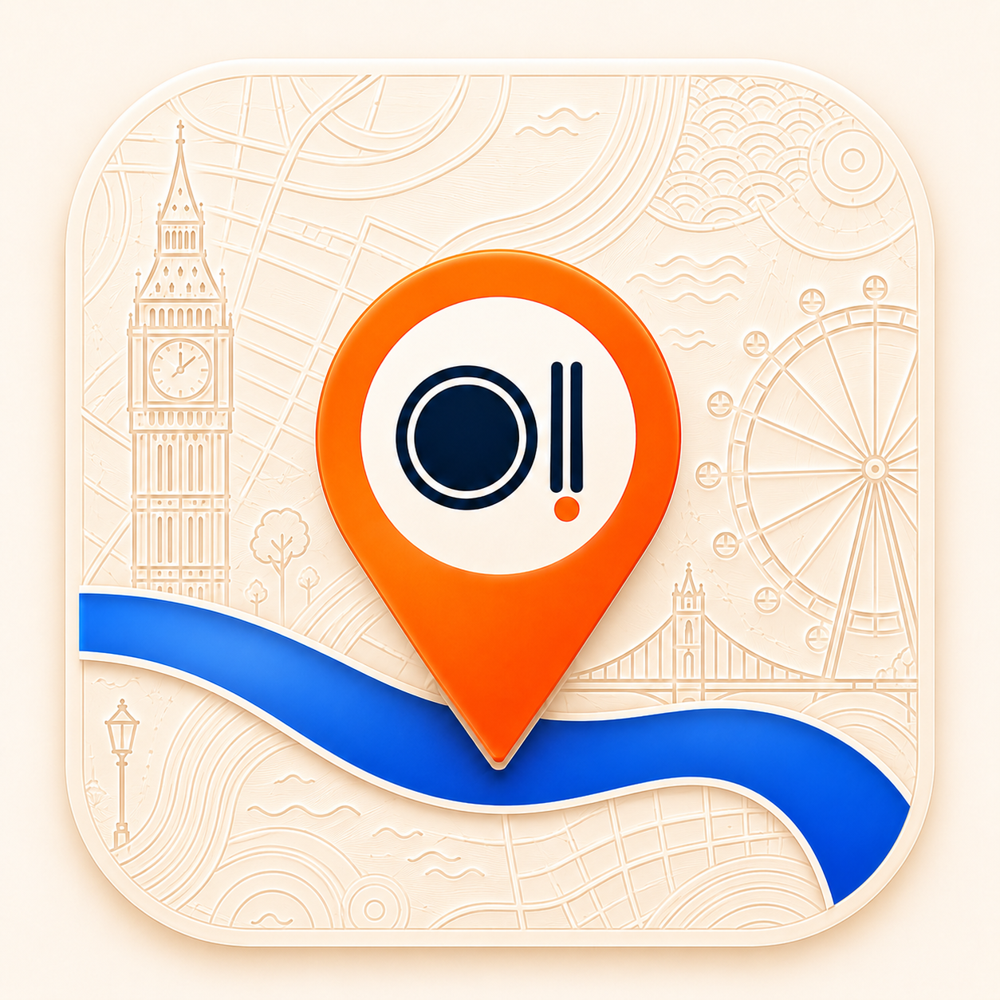

  

<h1 align="center">OAD London Food Map</h1>

  <strong>A polished, map-first guide for choosing where to eat in London.</strong>
   
  Explore OAD Europe 2026 restaurants by rank, mood, area, cuisine, price, branch, and your own shortlist.

  
  
  
  

  <a href="#start-here"><strong>Start Here</strong></a>
  ·
  <a href="#guide"><strong>User Guide</strong></a>
  ·
  <a href="#features"><strong>Features</strong></a>
  ·
  <a href="#tips"><strong>Tips</strong></a>
  ·
  <a href="#good-to-know"><strong>Good To Know</strong></a>

---

## The Short Version

OAD London Food Map turns the OAD Europe 2026 London selections into a fast, visual planning tool. Instead of reading a long list and then opening maps separately, you can compare quality, location, mood, price, and personal notes in one place.

<table>
  <tr>
    <td><strong>Best for</strong></td>
    <td>Finding a serious London meal without losing half an hour to tabs and group chat debate.</td>
  </tr>
  <tr>
    <td><strong>Core idea</strong></td>
    <td>Use curated OAD recognition as the starting point, then make the final choice by map, filters, and personal context.</td>
  </tr>
  <tr>
    <td><strong>Not for</strong></td>
    <td>Booking directly. The guide helps you decide, then points you to maps, restaurant sites, OAD pages, or phone links.</td>
  </tr>
</table>

## Start Here

| Step | What to do | Why it helps |
| --- | --- | --- |
| 1 | Open the deployed map link from the repository or project page. | Start with the real map, not a static list. |
| 2 | Choose <kbd>Destination</kbd>, <kbd>Casual Gems</kbd>, <kbd>Value Hunt</kbd>, or <kbd>Saved</kbd>. | Presets get you close quickly. |
| 3 | Refine by cuisine, London area, price estimate, guide list, or search. | Reduce noise without losing good options. |
| 4 | Select a restaurant from the list or a map pin. | Compare the place and its location together. |
| 5 | Check ranks, branches, links, notes, and review warnings. | Avoid weak data and wrong-branch surprises. |
| 6 | Save it as <kbd>Want</kbd>, <kbd>Booked</kbd>, <kbd>Visited</kbd>, or <kbd>Loved</kbd>. | Build a personal London food shortlist. |

## Guide

### Explore By Mood

<table>
  <tr>
    <th>Preset</th>
    <th>Use it when</th>
    <th>Typical result</th>
  </tr>
  <tr>
    <td><kbd>Destination</kbd></td>
    <td>You want a special meal or a high-confidence booking.</td>
    <td>Top-ranked and classical restaurants.</td>
  </tr>
  <tr>
    <td><kbd>Casual Gems</kbd></td>
    <td>You want something easier, relaxed, but still worth seeking out.</td>
    <td>Casual and value-led OAD picks.</td>
  </tr>
  <tr>
    <td><kbd>Value Hunt</kbd></td>
    <td>You care about price, convenience, or repeatable meals.</td>
    <td>Lower price estimates sorted for practical planning.</td>
  </tr>
  <tr>
    <td><kbd>Saved</kbd></td>
    <td>You already have contenders and want to choose from them.</td>
    <td>Your personal shortlist.</td>
  </tr>
</table>

### Refine The List

Use filters when you know what kind of meal you want:

| Filter | Helps you answer |
| --- | --- |
| Search | "Do I already have a place, chef, cuisine, or area in mind?" |
| Guide list | "Do I want Top Restaurants, Casual, Classical, or Cheap Eats?" |
| Price estimate | "Is this the right level for today?" |
| Cuisine | "What style of cooking do we feel like?" |
| Area | "What is nearby or realistic to reach?" |
| Sort | "Should I prioritise rank, name, guide type, or price?" |

### Read The Restaurant View

Each restaurant page is designed for decisions, not clutter.

| Section | What to look for |
| --- | --- |
| OAD rankings | Which guide lists include the restaurant and where it ranks. |
| Branch selector | Multiple London locations under the same restaurant, where available. |
| Why it might fit | Short reasons based on list, cuisine, price, and location. |
| Location quality | Confidence cues and review warnings before you travel. |
| Details | Address, chef, phone, website, hours, and useful links when available. |
| Your notes | Dishes, booking context, recommendations, or who to bring. |

## Features

<table>
  <tr>
    <td width="50%">
      <h3>Map-first discovery</h3>
      
See OAD-recognised restaurants across London and compare them spatially before committing.

    </td>
    <td width="50%">
      <h3>Decision-friendly filters</h3>
      
Filter by list, price, cuisine, area, search, saved status, and review flags.

    </td>
  </tr>
  <tr>
    <td width="50%">
      <h3>Personal shortlist</h3>
      
Mark places as <kbd>Want</kbd>, <kbd>Booked</kbd>, <kbd>Visited</kbd>, or <kbd>Loved</kbd>, and keep notes.

    </td>
    <td width="50%">
      <h3>Branch-aware planning</h3>
      
Restaurants with several London locations can show branch options instead of forcing one generic pin.

    </td>
  </tr>
  <tr>
    <td width="50%">
      <h3>Quality signals</h3>
      
Uncertain, unmapped, or branch-sensitive records are visible so you know when to double-check.

    </td>
    <td width="50%">
      <h3>Mobile-friendly use</h3>
      
Designed for quick planning on the move, including saved places and optional location centring.

    </td>
  </tr>
</table>

## What's Inside

| Coverage | Detail |
| --- | --- |
| Restaurants | 314 London restaurants from OAD Europe 2026. |
| Lists | Top Restaurants, Casual, Classical, and Cheap Eats. |
| Useful fields | Rank, cuisine, chef, area, estimated price, descriptions, images, links, and hours where available. |
| Mapping | Branch-aware pins and location quality cues. |
| Personal planning | Saved statuses, notes, and shortlist mode. |

## Who It Helps

<table>
  <tr>
    <td><strong>Visitors</strong></td>
    <td>Choose a small number of London meals with better confidence.</td>
  </tr>
  <tr>
    <td><strong>Locals</strong></td>
    <td>Build a serious "next places to try" list across neighbourhoods.</td>
  </tr>
  <tr>
    <td><strong>Groups</strong></td>
    <td>Reduce vague dinner debates by filtering around real constraints.</td>
  </tr>
  <tr>
    <td><strong>Food-focused travellers</strong></td>
    <td>Start from curated recognition instead of generic search results.</td>
  </tr>
</table>

## Tips

> Start broad, then narrow. Pick one preset first, then add only the filters that matter for the meal you are actually planning.

- Use <kbd>Destination</kbd> when the meal is the event.
- Use <kbd>Casual Gems</kbd> when you want quality without too much ceremony.
- Use <kbd>Value Hunt</kbd> when price and convenience matter.
- Use <kbd>Saved</kbd> once you have a serious shortlist.
- Treat price estimates as planning signals, not bill predictions.
- Check branch options before navigating to multi-location restaurants.
- Add notes immediately so future-you remembers why a place mattered.

## Good To Know

> This guide helps you choose. It does not replace the restaurant's own booking page, opening hours, menus, or availability.

Restaurant information can change. Always confirm hours, menus, location, availability, and booking details directly with the restaurant before making plans.

Guest saves stay in your browser. If Google sign-in is available, signing in lets your shortlist and notes sync more reliably across sessions.

The location button only centres the map on your current position if your browser allows it. Your position is not saved by the app.

## Feedback

Found a great meal through the map? Share it with someone planning food in London.

Spotted something wrong? Open an issue with the restaurant name, what you noticed, and any useful source link so the guide can be improved.

## License

Apache-2.0
